# Büyük Sayıları Okuma

## Büyük Sayılar Nasıl Okunur?

---

### Düşünelim?

1. Aşağıdaki tabloda bazı sayılar ve okunuşları verilmiştir. Sayıları okurken nasıl bir yol izlendiğini düşününüz.
Milyar, milyon ve bin kelimelerinin nasıl kullanıldığını açıklayınız.

| Sayı            | Okunuşu                                                                |
|-----------------|------------------------------------------------------------------------|
| 12 485 368      | On iki **milyon** dört yüz seksen beş **bin** üç yüz altmış sekiz.     |
| 306 100 450 026 | Üç yüz altı **milyar** yüz **milyon** dört yüz elli **bin** yirmi altı |
| 35 000 000      | Otuz beş **milyon**                                                    |
| 42 000 230 964  | Kırk iki **milyar** iki yüz otuz **bin** dokuz yüz altmış dört         |

---

### Nasıl Yapılır?

Sayılar sağdan itibaren üçerli gruplara ayrılır. Her bir gruba bölük denir.
Tabloda görüldüğü gibi bölük isimleri sağdan sola doğru binler, birler, milyonlar,
milyarlar şeklindedir.

<table>
    <tr><td colspan="3">Milyarlar</td><td colspan="3">Milyonlar</td><td colspan="3">Binler</td><td colspan="3">Birler</td></tr>
    <tr><td>3</td><td>2</td><td>1</td><td>3</td><td>2</td><td>1</td><td>3</td><td>2</td><td>1</td><td>3</td><td>2</td><td>1</td></tr>
</table>

4000512785 Sayısını nasıl okuyacağımızı adım adım yazalım.

1 - Sayı bölüklerine ayrılır $\rightarrow$ 4 000 512 785

2 - Her bölükten sonra bölüğün ismi söylenir (birler bölüğünün adı söylenmez) $\rightarrow$ 4 **milyar** 000 **milyon** 512 **bin** 785

3 - Bir bölükteki sayıların tamamı sıfırsa bölüğün adı söylenmez $\rightarrow$ 4 **milyar** 000 ~~milyon~~ 512 **bin** 785

Yani okunuşu $\rightarrow$ 4 milyar ~~000 milyon~~ 512 bin 785 : Dört **milyar** beş yüz on iki **bin** yedi yüz seksen beş

---

### Örnek - 1

Ülke nüfuslarının okunuşlarını yazınız.

| Bayrak                   | Ülke Adı  | Ülke Nüfusu   | Nüfusun Okunuşu                               |
|--------------------------|-----------|---------------|-----------------------------------------------|
|   | ABD       | 335 934 376   | 

Cevabı Gör

 Üç yüz otuz beş **milyon** dokuz yüz otuz dört **bin** üç yüz yetmiş altı. 

 |
|   | Kanada    | 40 027 040    | 

Cevabı Gör

 Kırk **milyon** yirmi yedi **bin** kırk. 

 |
|   | Sırbistan | 6 647 003     | 

Cevabı Gör

 Altı **milyon** altı yüz kırk yedi **bin** üç. 

 |
|   | Rusya     | 146 424 729   | 

Cevabı Gör

 Yüz kırk altı **milyon** dört yüz yirmi dört **bin** yedi yüz yirmi dokuz. 

 |
|   | Kuveyt    | 4 670 713     | 

Cevabı Gör

 Dört **milyon** altı yüz yetmiş **bin** yedi yüz on üç. 

 |
|   | Brezilya  | 203 000 512   | 

Cevabı Gör

 İki yüz üç **milyon** beş yüz on iki. 

 |
|   | Nijerya   | 218 541 000   | 

Cevabı Gör

 İki yüz on sekiz **milyon** beş yüz kırk bir **bin**. 

 |
|   | Fransa    | 68 000 000    | 

Cevabı Gör

 Altmış sekiz **milyon**. 

 |
|  | Belçika   | 11 000 313    | 

Cevabı Gör

 On bir **milyon** üç yüz on üç. 

 |
|  | Çin       | 1 409 670 000 | 

Cevabı Gör

 Bir **milyar** dört yüz dokuz **milyon** altı yüz yetmiş **bin**. 

 |
|  | Hindistan | 1 427 000 903 | 

Cevabı Gör

 Bir **milyar** dört yüz yirmi yedi **milyon** dokuz yüz üç. 

 |

---

### Örnek - 2

Sayıların okunuşlarını yazınız.

| Bilgi Notu                         | Sayı           | Okunuşu                                               |
|------------------------------------|----------------|-------------------------------------------------------|
| Filmin toplam izlenme sayısı       | 40 050 000     | 

Cevabı Gör

 Kırk **milyon** elli **bin**. 

 |
| Kütüphanedeki dijital kitap sayısı | 105 008 300    | 

Cevabı Gör

 Yüz beş **milyon** sekiz **bin** üç yüz. 

 |
| Şirketin piyasa değeri             | 2 080 400 000  | 

Cevabı Gör

 İki **milyar** seksen **milyon** dört yüz **bin**. 

 |
| Toplam balık türü popülasyonu      | 900 000 750    | 

Cevabı Gör

 Dokuz yüz **milyon** yedi yüz elli. 

 |
| Otobüs bilet fiyatı                | 7 000 005      | 

Cevabı Gör

 Yedi **milyon** beş. 

 |
| Bir plajdaki tahmini kum tanesi    | 100 001 000    | 

Cevabı Gör

 Yüz **milyon** **bin**. 

 |
| Güneş sisteminde mm bir sapma      | 5 002 000 000  | 

Cevabı Gör

 Beş **milyar** iki **milyon**. 

 |
| Bankanın günlük transfer miktarı   | 20 700 000 080 | 

Cevabı Gör

 Yirmi **milyar** yedi yüz **milyon** seksen. 

 |
| Matematik dizisinin bir terimi     | 1 000 000 001  | 

Cevabı Gör

 Bir **milyar** bir. 

 |
| İşlemcinin saniyedeki işlem sayısı | 12 000 012 012 | 

Cevabı Gör

 On iki **milyar** on iki **bin** on iki. 

 |

---

### Örnek - 3

Sayıları bölüklerine ayırıp okunuşlarını yazınız.

| Sayı           | Bölüklere Ayrılmış Sayı | Okunuşu            |
|----------------|-------------------------|--------------------|
| 3000020008     | 

Cevabı Gör

 3 000 020 008 

 | 

Cevabı Gör

 Üç **milyar** yirmi **bin** sekiz. 

 |
| 60000327       | 

Cevabı Gör

 60 000 327 

 | 

Cevabı Gör

 Altmış **milyon** üç yüz yirmi yedi. 

 |
| 101100010001   | 

Cevabı Gör

 101 100 010 001 

 | 

Cevabı Gör

 Yüz bir **milyar** yüz **milyon** on **bin** bir. 

 |
| 9002000800     | 

Cevabı Gör

 9 002 000 800 

 | 

Cevabı Gör

 Dokuz **milyar** iki **milyon** sekiz yüz. 

 |

---

## Okunuşu Verilen Sayılar Nasıl Yazılır?

### Örnek - 1

Gök cisimlerinin güneşe uzaklıkları verilmiştir. Okunuşları sayıyla yazınız.

| Resim                    | Gezegen Adı | Okunuşu                                                              | Sayı        |
|:------------------------:|-------------|----------------------------------------------------------------------|-------------|
|  | Merkür      | Elli iki **milyon** yüz elli altı **bin** doksan beş.                | 

Cevabı Gör

 52 156 095 

 |
|  | Venüs       | Yüz on **milyon**.                                                   | 

Cevabı Gör

 110 000 000 

 |
|  | Dünya       | Yüz kırk sekiz **milyon** kırk sekiz **bin** kırk sekiz.             | 

Cevabı Gör

 148 048 048 

 |
|  | Ay          | Yüz kırk sekiz **milyon** üç yüz seksen dört                         | 

Cevabı Gör

 148 000 384 

 |
|  | Mars        | İki yüz otuz **milyon** yetmiş beş                                   | 

Cevabı Gör

 230 000 075 

 |
|  | Phonos      | İki yüz otuz **milyon** dokuz **bin**                                | 

Cevabı Gör

 230 009 000 

 |
|  | Deimos      | İki yüz otuz **milyon** yirmi üç **bin** üç                          | 

Cevabı Gör

 230 023 003 

 |
|  | Vesta       | Üç yüz yetmiş iki **milyon** altı yüz **bin** iki yüz seksen dokuz   | 

Cevabı Gör

 372 600 289 

 |
|  | Ceres       | Dört yüz yirmi üç **milyon** dört yüz **bin** otuz iki               | 

Cevabı Gör

 423 400 032 

 |
|  | Pallas      | Dört yüz altmış **milyon** on dokuz                                  | 

Cevabı Gör

 460 000 019 

 |
|  | Hygeia      | Beş yüz yirmi üç **milyon** elli dört **bin**                        | 

Cevabı Gör

 523 054 000 

 |
|  | Jüpiter     | Yedi yüz seksen **milyon** sekiz **bin** yedi yüz                    | 

Cevabı Gör

 780 008 700 

 |
|  | Satürn      | Bir **milyar** dört yüz otuz sekiz **milyon**                        | 

Cevabı Gör

 1 489 000 000 

 |
|  | Uranüs      | İki **milyar** dokuz yüz yetmiş **milyon** iki yüz beş **bin** sekiz | 

Cevabı Gör

 2 970 205 008 

 |
|  | Miranda     | Üç **milyar** kırk beş **bin**                                       | 

Cevabı Gör

 3 000 045 000 

 |
|  | Neptün      | Dört **milyar** iki **bin** altı yüz üç                              | 

Cevabı Gör

 4 000 002 603 

 |

---

### Sayıları Okuma Problemleri

### Problem - 1

Farklı yüzlerinde sayılar yazan ve sayıların toplamları 9 olan 11 kağıt yan yana diziliyor.
Dizilen kağıtlarda yazan sayının okunuşu "Kırk bir **milyar** yedi yüz yirmi sekiz **milyon**
dokuz yüz üç **bin** iki yüz doksan beş" oluyor. Tüm kağıtlar sırası değiştirmeden
ters çevrilip tekrar okunursa sayının okunuşu ne olur?

Cevabı Gör

|     4     |     1     |     7     |     2     |     8     |     9     |     0     |     3     |     2     |     9     |     5     |
|:---------:|:---------:|:---------:|:---------:|:---------:|:---------:|:---------:|:---------:|:---------:|:---------:|:---------:|
| 9 - 4 = 5 | 9 - 1 = 8 | 9 - 7 = 2 | 9 - 2 = 7 | 9 - 8 = 1 | 9 - 9 = 0 | 9 - 0 = 9 | 9 - 3 = 5 | 9 - 2 = 7 | 9 - 9 = 0 | 9 - 5 = 4 |
|     5     |     8     |     2     |     7     |     1     |     0     |     9     |     5     |     7     |     0     |     4     |

Elli sekiz **milyar** iki yüz yetmiş bir **milyon** doksan beş **bin** yedi yüz dört

---

### Problem - 2

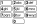

Tuşlu telefonlarda bir harf yazmak için harfin bulunduğu sayıya harf o tuşta kaçıncı sırada ise o kadar
basılır. Örneğin görseldeki tuşlarda “ALİ” yazmak için basılan tuşlar **2555444** olur ve bu sayının okunuşu **“iki milyon beş yüz elli beş bin dört yüz kırk dört”** olur. Buna göre bu tuşlu telefonda BEKİR
yazmak için basılan tuşlar ile oluşan sayının **milyonlar** bölüğündeki rakamların toplamı kaçtır?

Cevabı Gör

223355444777 sayısı oluşur bölüklere ayırırsak sayı şu şekilde olur.

| Milyarlar | Milyonlar | Binler | Birler |
|:---------:|:---------:|:------:|:------:|
|   223     |    355    |  444   |  777   |

Milyonlar bölüğündeki rakamlar 3,5,5 ve toplamı 3 + 5 + 5 = 13 olur.

---

# Basamak Kavramı

## Mısır Rakamlarını Keşfedelim

### Örnek - 1

Eski Mısırlı Ahmes MÖ 1640 yılında MÖ 2000 yılında yazılmış bir papirüsü kopyaladı.
Bu papirüsü araştıran bir araştırmacı Mısır rakamlarıyla yazılan sayıları günümüz
rakamlarıyla ifade etmeyi başardı. Ancak eşleştirdiği rakamlar masaya çıkan kedi
tarafından dağıtıldı. Dağılan eski Mısır rakamlarıyla günümüz rakamlarını eşleştiriniz.

| Günümüz Rakamlarıyla | Mısır Rakamlarıyla               |
|----------------------|----------------------------------|
|a. 2 304 009          | 

Cevabı Gör

 ..<u>b</u>.. 

    |
|b. 600 470            | 

Cevabı Gör

 ..<u>f</u>.. 

    |
|c. 1 023 041          | 

Cevabı Gör

 ..<u>d</u>.. 

    |
|ç. 42 150             | 

Cevabı Gör

 ..<u>e</u>.. 

    |
|d. 3 705              | 

Cevabı Gör

 ..<u>a</u>.. 

    |
|e. 208 132            | 

Cevabı Gör

 ..<u>ç</u>.. 

    |
|f. 3 006 025          | 

Cevabı Gör

 ..<u>c</u>.. 

    |

---

### Örnek - 2

Yukarıdaki eşleştirmeden yola çıkara mısır rakamlarının günümüz sayılarıyla ifade ettiği değerleri yazınız.

|  |  |  |  |  |  |   |
|:----------------:|:----------------:|:----------------:|:----------------:|:----------------:|:----------------:|:----------------:|
| 

Cevabı Gör

 1 

 | 

Cevabı Gör

 1 000 

 | 

Cevabı Gör

 100 

 | 

Cevabı Gör

 1 000 000 

 | 

Cevabı Gör

 100 000 

 | 

Cevabı Gör

 10 

 | 

Cevabı Gör

 10 000 

 |

---

## Mısır Rakamlarını Kullanalım

### Örnek - 1

Günümüz rakamlarıyla verilen sayıları mısır rakamlarıyla yazınız.

| Günümüz Rakamlarıyla | Mısır Rakamlarıyla       |
|----------------------|--------------------------|
| 4 105 203            | 
Cevabı Gör

  

 |
| 401 305              | 
Cevabı Gör

  

 |
| 83 047               | 
Cevabı Gör

  

 |
| 3 210 037            | 
Cevabı Gör

  

 |

---

### Örnek - 2

Mısır rakamlarıyla verilen sayıları günümüz rakamlarıyla yazınız.

| Mısır Rakamlarıyla       | Günümüz Rakamlarıyla     |
|--------------------------|--------------------------|
|  | 

Cevabı Gör

 1 002 050 

                | 
|  | 

Cevabı Gör

 43 000 

                   |
|  | 

Cevabı Gör

 310 500 

                  |
|  | 

Cevabı Gör

 2 006 005 

                |

## Abaküsteki Sayılar

### Örnek - 1

Verilen abaküslerde gösterilen sayıları yazınız.

| 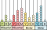 | 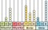 |
|--------------------------|--------------------------|
| 

Cevabı Gör

 131 356 423 471 

 | 

Cevabı Gör

 26 000 745 209 

 |

| 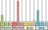 | 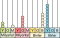 |
|--------------------------|--------------------------|
| 

Cevabı Gör

 300 090 001 500 

 | 

Cevabı Gör

 201 040 005 800 

 |

---

### Örnek - 2

Verilen sayıları abaküste gösteriniz.

| 37 426 298 194 | 120 000 000 729 |
|--------------------------|--------------------------|
| 

Cevabı Gör

 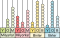 

 | 

Cevabı Gör

 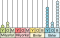 

 |

| 2 705 000 003 |  700 040 006 |
|--------------------------|--------------------------|
| 

Cevabı Gör

  

 | 

Cevabı Gör

 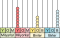 

 |

---

### Örnek - 3

Bu abaküslerde 15 boncukla (renkleri önemsiz) yapabileceğiniz en büyük ve en küçük sayıları yazınız.

Cevabı Gör

|          En Büyük         |          En Küçük         |
|---------------------------|---------------------------|
| 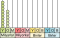  | 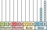  |
|  960 000 000 000          |  69                       |

---

### Örnek - 4

Bir abaküse boncuklar dizilerek “elli **milyar** dört yüz yirmi dört **milyon** üç yüz otuz dört **bin** üç yüz yirmi üç” sayısı oluşturulmuştur. Ayşe bu abaküsü yere düşürmüş ve bazı boncuklar yerlerinden çıkmıştır. Aşağıda abaküsün yere düştükten sonraki görüntüsü verilmiştir.

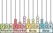

Buna göre Ayşe kaç boncuğu düşürmüştür?

Cevabı Gör

50 424 334 323 sayısını abaküste gösterelim.

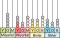

Fazla olanları gri renkle gösterirsek 16 tane olduğunu görebiliriz.

---

## Emlak Oyun

Bir emlak oyununun paraları şöyledir.

Bu paralarla aşağıdaki ürünler satın alınmak istenmektedir. En az sayıda  para kullanılacak ve para üstü
alınmayacaktır. Her bir ürün için hangi paradan kaç tane kullanmanız gerekir?

|      Resim     |    Ürün    |    Fiyat        |          Paralar        |
|:--------------:|------------|-----------------|-------------------------|
|  | Araba      | 10 300 800 201  | 

Cevabı Gör

1 tane 10 000 000 000

3 tane 100 000 000

8 tane 100 000

2 tane 100

1 tane 1

 |
|  | Ev         | 805 207 009 082 | 

Cevabı Gör

8 tane 100 000 000 000

5 tane 1 000 000 000

2 tane 100 000 000

7 tane 1 000 000

9 tane 1 000

8 tane 10

2 tane 1

 |
|  | Bisiklet   | 40 304 270      | 

Cevabı Gör

4 tane 10 000 000

3 tane 100 000

4 tane 1 000

2 tane 100

7 tane 10

 |
|  | Scooter    | 210 530 604     | 

Cevabı Gör

2 tane 100 000 000

1 tane 10 000 000

5 tane 100 000

3 tane 10 000

6 tane 100

4 tane 1

 |
|  | Motosiklet | 20 407 019      | 

Cevabı Gör

2 tane 10 000 000

4 tane 100 000

7 tane 1 000

1 tane 10

9 tane 1

 |
|  | Kaykay     | 10 708 700      | 

Cevabı Gör

1 tane 10 000 000

7 tane 100 000

8 tane 1 000

7 tane 100

 |

---

## Basamak ve Değeri

10 tane rakamımız var (0, 1, 2, 3, 4, 5, 6, 7, 8, 9) bu rakamlarla sonsuz farklı sayıyı nasıl yazabiliriz?
Rakamlarımız sonlu olsada yan yana yazabileceğimiz rakamların bir sonu yok. İşte rakamları yazdığımız bu yerlere **basamak** denir.
Basamakların sonu yoktur. Bu sayede sonlu rakamla sonsuz sayıyı yazabiliriz.

Örneğin 5 555 555 sayısı sadece 5 rakamlarından oluşmaktadır. Ancak buradaki her 5 rakamının ifade ettiği değer farklıdır.
Rakamların basamakla birlikte ifade ettiği bu değere **basamak değeri** denir.

| Rakamlar       |     5     |     5     |     5     |     5     |     5     |     5     |     5     |
|:--------------:|:---------:|:---------:|:---------:|:---------:|:---------:|:---------:|:---------:|
| Basamak Değeri | 5 000 000 | 500 000   |  50 000   |  5 000    |   500     |    50     |     5     |

Bazı basamakların isimleri aşağıdaki tabloda gösterilmiştir.

Bölükteki en küçük basamakla bölüğün adı aynıdır. Daha sonra, on bölük adı, yüz bölük adı olacak şekilde ilerler.

## Büyük Şirketler

Bazı şirketlerin büyüklükleri verilmiştir. Bu sayılarda altı çizili olan rakamın basamak değerini yazınız.

| Şirket Logosu | Şirket Adı                      | Şirket Büyüklüğü   | Basamak Değeri |
|:-------------:|---------------------------------|--------------------|----------------|
|  | Türkiye Petrol Rafinerileri A.Ş. | 88 5<u>5</u>2 170 327 | 

Cevabı Gör

 50 000 000 

 |
|  | Enerji Piyasaları İŞletme A.Ş.   | 6<u>3</u> 825 723 210 | 

Cevabı Gör

 3 000 000 000 

 |
|  | Türk Hava Yolları A.O.           | <u>6</u>2 853 000 000 | 

Cevabı Gör

 60 000 000 000 

 |
|  | Botaş Boru Hatları ve P.T.A.Ş    | 51 050 780 7<u>2</u>7 | 

Cevabı Gör

 20 

 |
|  | Petrol Ofisi A.Ş                 | 49 921 93<u>3</u> 106 | 

Cevabı Gör

 3 000 

 |
|  | Opet Petrolcülük A.Ş             | 42 <u>9</u>97 122 285 | 

Cevabı Gör

 900 000 000 

 |
|  | Ford Otomotiv Sanayi A.Ş         | 33 292 <u>0</u>30 000 | 

Cevabı Gör

 0 

 |
|  | Bim Birleşik Mağazaları A.Ş      | 32 322 980 96<u>7</u> | 

Cevabı Gör

 7 

 |
|  | Ereğli Demir ve Çelik Fab. T.A.Ş | <u>2</u>7 015 325 254 | 

Cevabı Gör

 20 000 000 000 

 |
|  | Arçelik A.Ş                      | 26 <u>9</u>04 384 249 | 

Cevabı Gör

 900 000 000 

 |
|  | Ahlatçı Kuyumculuk San. ve T.A.Ş | 24 886 <u>4</u>05 208 | 

Cevabı Gör

 400 000 

 |
|  | RC Rönesans İnş T.A.Ş            | 23 3<u>5</u>9 057 000 | 

Cevabı Gör

 50 000 000 

 |
|  | Turkcell İletişim Hiz. A.Ş       | 2<u>1</u> 292 475 829 | 

Cevabı Gör

 1 000 000 000 

 |
|  | Türk Telekomünikasyon A.Ş        | 20 430 000 <u>9</u>00 | 

Cevabı Gör

 900 

 |
