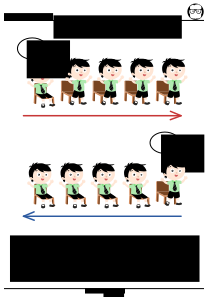

# Açılar

## Birim Açı
Verilen birim açılardan istediğiniz kadarını kağıttan kesiniz Daha sonra birim açıyı kullanarak aşağıda verilen açıların içine kaç tane birim açı sığacağını bulunuz. Açıları büyükten küçüğe sıralayınız?

---

## Açıları Ölçelim
