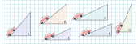
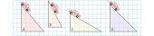
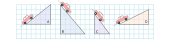

# Eğim

**1.** Bir otomobil fabrikası ürettiği araçları farklı rampalarda test etmektedir. Araç aşağıdaki rampalardan hangisinde daha çok zorlanır? Rampaları zorluk düzeyine göre sıralayınız.

**a.** 

> Cevap :

**b.**

> Cevap :

**c.**

> Cevap :

**SORU :** Rampaların zorluk düzeyini matematiksel olarak ifade etmek için bir yöntem geliştiriniz.

> Cevap :
>
> 

**2.** Aşağıdaki rampalardan hangisinde aracın daha çok zorlanacağını belirleyiniz. Rampaların zorluk düzeyini matematiksel olarak nasıl ifade edersiniz?

> Cevap :

**3.** Aşağıda verilen rampaları eğimlerine göre küçükten büyüğe sıralayınız.

**a.**

> Cevap :

**b.**

> Cevap :

**c.**

> Cevap :

**4.** Aşağıda verilen kareli zeminde $\frac{3}{8}; -\frac{2}{3}; \frac{7}{4}; -\frac{5}{2} ; 0,3;$ % $70; -1,3$ eğimlerinde rampalar oluşturunuz.

**5.** Engelli kişilerin tekerlekli sandalye kullanırken hareketlerini kolaylaştırmak için kaldırımların yolla birleştiği yerlere rampalar yapılır. Bu rampların eğimi en fazla 0,08 olmalıdır. (TSE) Aşağıdaki resimlerde yapılması planlanan engelli rampaları vardır. Bu rampalardan standartları sağlayanları işaretleyiniz.

**6.** Bir kaydırak firması farklı eğimlerde kaydıraklar üretmektedir. Aşağıda eğimleri verilen kaydırakların bir kenarları bilinmemektedir. Verilmeyen kenarların uzunluklarını bulunuz.

> Cevaplar:
>
> 
>
> 
>
> 
>
> 
>
> 

**7.**Lazer işaretleme istenilen eğimde ve doğrultuda hatasız yapılar inşa etmek için kullanılan bir yöntemdir. Aşağıdaki sorularda istenilen eğimde işaretleme yapabilmek için lazerin hangi noktaya göre ayarlanması gerektiğini bulunuz.

**a.** $\frac{1}{2} $ eğimle bir işaretleme yapılabilmesi için lazerin hangi noktaya ayarlanması gerekir.

> Cevap :

**b.** %40 eğimle bir işaretleme yapılabilmesi için lazerin hangi noktaya ayarlanması gerekir.

> Cevap :

**c.** $-\frac{2}{3} $ eğimle bir işaretleme yapılabilmesi için lazerin hangi noktaya ayarlanması gerekir.

> Cevap :

**d.** $-0,6$ eğimle bir işaretleme yapılabilmesi için lazerin hangi noktaya ayarlanması gerekir.

> Cevap :

**e.** 0,25 eğimle bir işaretleme yapılabilmes için lazerin hangi noktaya ayarlanması gerekir.

 

> Cevap :

## Eğim Soruları

**8.** Yukarıda verilen merdivenin basamaklarının yüksekliği 15 cm, derinliği 20 cm'dir. Bu merdivenin eğimi kaçtır?

**9.** Bir merdiven $\frac{10}{16}$ eğimle duvara dayalı olarak durmaktadır. Bu merdivenin en üst noktasının yerden yüksekliği 5 metre olduğuna göre, merdivenin en alt noktasının duvardan uzaklığı kaç cm dir?

**10.** Yukarıda verilen kamyon rampasının eğimi $\frac{6}{8}$ m olduğuna göre rampanın verilmeyen kenarı kaç m dir?

**11.** Şekilde R noktasından başlayan engelli rampasının eğimi %10'dur. Yerden yüksekliği 1 m olan bu rampanın eğimi % 8 olsaydı, rampa hangi noktadan başlardı?

**12.** Yukarıda verilen şekilde kitaplığa dayalı merdivenlerden kısa olanının eğimi 1'dir. Buna göre uzun merdivenin eğimini bulunuz.

**13.** Bir platform için yapılacak rampanın eğimi % 60'dır. Rampanın platforma olan uzaklığı sabit tutulup palatformun yüksekliği $\frac{1}{3}$ oranında artırılırsa rampanın eğimi nasıl değişir.

# Doğruda Eğim

**1.** Aşağıda verilen denklemlerin grafiklerini çizerek eğimlerini bulunuz.

**a.**  $y = x + 2$ denkleminin grafiğini çizerek eğimini bulunuz.

| $x$  |      |      |      |      |
| :--: | ---- | ---- | ---- | ---- |
| $y$  |      |      |      |      |

> Eğim :

**b.**  $y = -x + 2$ denkleminin grafiğini çizerek eğimini bulunuz.

| $x$  |      |      |      |      |
| :--: | ---- | ---- | ---- | ---- |
| $y$  |      |      |      |      |

> Eğim :

**SORU :** x bilinmeyeninin işaretindeki değişiklik eğimde nasıl bir değişiklilik oluşturdu?

> Cevap :

**c.**  $y = 3x - 2$ denkleminin grafiğini çizerek eğimini bulunuz.

| $x$  |      |      |      |      |
| :--: | ---- | ---- | ---- | ---- |
| $y$  |      |      |      |      |

> Eğim :

**d.** $y = \frac{1}{2}x$ denkleminin grafiğini çizerek eğimini bulunuz.

| $x$  |      |      |      |      |
| :--: | ---- | ---- | ---- | ---- |
| $y$  |      |      |      |      |

> Eğim :

**SORU :** Denklemlerle eğimler arasında bir bağ fark ettiniz mi? Açıklamalarınızı yazınız.

> Cevap :
>
> 

**e.** $ 4x - 2y + 11 = 0$ denkleminin grafiğini çizerek eğimini bulunuz.

| $x$  |      |      |      |      |
| :--: | ---- | ---- | ---- | ---- |
| $y$  |      |      |      |      |

> Eğim :

**f.** $3 -\frac{x}{3}=\frac{y}{2}$ denkleminin grafiğini çizerek eğimini bulunuz.

| $x$  |      |      |      |      |
| :--: | ---- | ---- | ---- | ---- |
| $y$  |      |      |      |      |

> Eğim :

**g.** $x = 3$ denkleminin grafiğini çizerek eğimini bulunuz.

| $x$  |      |      |      |      |
| :--: | ---- | ---- | ---- | ---- |
| $y$  |      |      |      |      |

> Eğim :

**h.**  $y=5$ denkleminin grafiğini çizerek eğimini bulunuz.

| $x$  |      |      |      |      |
| :--: | ---- | ---- | ---- | ---- |
| $y$  |      |      |      |      |

> Eğim :

**SORU :** Bir denklemin eğimini grafiğini çizmeden bulmak için ve eğimi bulunamayan denklemler için notlarınızı yazınız.

>  Cevap
>
> 

**2.** Aşağıda denklemi verilen doğruların eğimlerini grafik çizmeden bulunuz.

**a.** $y=8x$ 

**b.** $y = -6x$

**c.** $y = \frac{x}{2}$

**d.** $y = -\frac{2x}{3}$

**e.** $3y=4x$

**f.** $8y=-2x$

**g.** $y = x + 4$

**h.** $y=-3x+1$

**i.** $y = \frac{3x}{5}+7$

**j.** $y = -x + \frac{1}{2}$

**k.** $4y = 6 -2x$

**l.** $5y = 8 -4x$

**m.** $2x - 4y + 1 = 0$

**n.** $6x + 3y - 1 = 0$

**o.** $\frac{y}{4}-\frac{5x}{2}+7=0$

**p.** $\frac{3x}{2}+\frac{2y}{3}-3 = 0$

**3.** Aşağıda geçtiği iki nokta verilen doğruların grafiklerini çizerek eğimlerini bulunuz.

**a.**   A ( 3 , 0 )            B ( 0 , 4 )

> Eğim :

**b.**   A ( 2 , 3 )            B ( 4 , 1 )

> Eğim :

**c.**   A ( -5 , 2 )            B ( 2 , -5 )

> Eğim :

**d.**   A ( -3 , -2 )            B ( -5 , -6 )

> Eğim :

**SORU :** En az iki noktası birilen bir doğrunun eğimini grafiğini çizmeden nasıl bulabiliriz?

> Cevap :

**4.** Aşağıda iki noktası verilen doğruların eğimlerini bulunuz.

**a.** A( 1, 1 )    B( -3, 3 )

**b.** C( -2, -1 )    D( 2, 1 )

**c.** D( 3, -2 )    E( 4, 3 )

**d.** F( -2, 3 )    G( 2, -1 )

**e.** H( 4, -2 )    İ( 1, 1 )

**f.** J( 0, 3 )    K( 6, 0 )

**g.** L( -3, 4 )    M( 7, 4 )

**h.** N( -1, -7 )    O( -1, 7 )

**5.** Aşağıda bir noktası ve eğimi verilen doğruların grafiklerini çiziniz.

**a.** $A ( 2 , 3 )$            Eğim = $\frac{1}{2}$

**b.** $B ( 0 , 0 )$            Eğim =$ -1$

**c.** $C ( 1 , 2 )$            Eğim = $-\frac{2}{5}$

**d.** $D ( -3 , 2 )$            Eğim = % 25 

**e.** $E (-1,-2)$            Eğim =  $- 0,4$ 

## Karşık Sorular

**6.** Aşağıda verilen noktaları başlangıç noktası ile birleşen doğruların eğimlerini bulunuz.

**a.** $( 5 , 4 )$

**b.** $(-7,3)$

**c.** $(-2,0)$

**d.** $(2,-3)$

**7.** Aşağıda orjinden geçen doğrular verilmiştir. Doğruları eğimi en fazla olandan en az olana doğru sıralayınız.

**8.** Aşağıda verilen d doğrusunun eğimi 3 olduğuna göre a kaçtır?

**9.** Yukarıdaki kareli zeminde verilen A noktasından yola çıkan bir hareketli, eğim 1 olan yolu izleyerek 2. duraktaki noktalardan birine ulaştıktan sonra bu noktadan eğimi 2 olan yolu izleyerek 3. duraktaki noktalardan birine ulaşıyor.

Ardışık iki durak arasında izlediği yollar doğrusal olduğuna göre bu hareketli, 3. durakta bulunduğu noktadan eğimi 3 olan yolu izleyerek 4. duraktaki hangi noktaya ulaşır?

**10.** Yukarıda kareli zemin üzerinde bir ada ve bu adaya doğru ilerlemekte olan bir balıkçı teknesi modellenmiştir. A noktasındaki balıkçı teknesi doğrusal bir yol boyunca hareket ederek adaya ulaşmıştır. Bu tekne B, C, D, E noktalarının birinden geçtiğine göre izlediği yolun eğimi kaçtır?

**11.** Bir binanın acil çıkış kapısı kaldırımdan daha yüksek olduğu için kapının önüne yükseklikleri 15 cm, derinlikleri 125 cm olan iki basamaklı bir merdiven ve bu merdivenin yanına bir engelli rampası yapılmıştır.

Buna göre yapılan engelli rampasının eğimi kaçtır?

**12.** Bir çiftçi bahçesindeki ağacın sola doğru eğildiğini fark edip ağacın 45 cm uzağından bir destek koyarak ağacı dik konuma getirmiştir. Bir süre sonra ağacın sağa doğru eğildiğini fark eden çiftçi bu defa ağacın 60 cm uzağından ikinci bir destek koyarak ağacı dik konuma getirmiştir.

İki desteğin ağaca değdiği noktaların yerden yükseklikleri arasındaki fark 20 cm ve desteklerin eğimleri eşit olduğuna göre ilk desteğin ağaca değdiği noktanın yerden yüksekliği kaç santimetredir?

**13.** Bir bilgisayar programı, koordinat sisteminde bir noktayı, her bir adımında noktanın x eksenine uzaklığını 1 birim azaltacak ve y eksenine uzaklığını 2 birim artıracak şekilde hareket ettirmektedir.

$A ( -2, 7 )$ noktası bu bilgisayar programı ile orjinden geçen ve eğimi $-\frac{1}{2}$ olan doğru üzerine getirilmeye çalışılıyor. Buna göre bu program kullanılarak A noktası en az kaçıncı adımda ilk defa bu doğru üzerinde yer alır?

**14.** Zehra Öğretmen tasarladığı bir etkinlikte birim kareli zemin üzerinde yukarıda gösterildiği gibi bir dikdörtgen çizmiş ve bu dikdörtgenin uzun kenarları üzerinde köşelerinden itibaren 1’er birim aralıklarla noktalar işaretlemiştir. Bu etkinlikte Zehra Öğretmen öğrencilerinden dikdörtgen üzerinde işaretli noktaların ikisinden geçen ve bu dikdörtgeni iki eş çokgensel bölgeye ayıran bir doğru çizmelerini istemektedir.Buna göre çizilen doğrunun eğimi ne olur?
